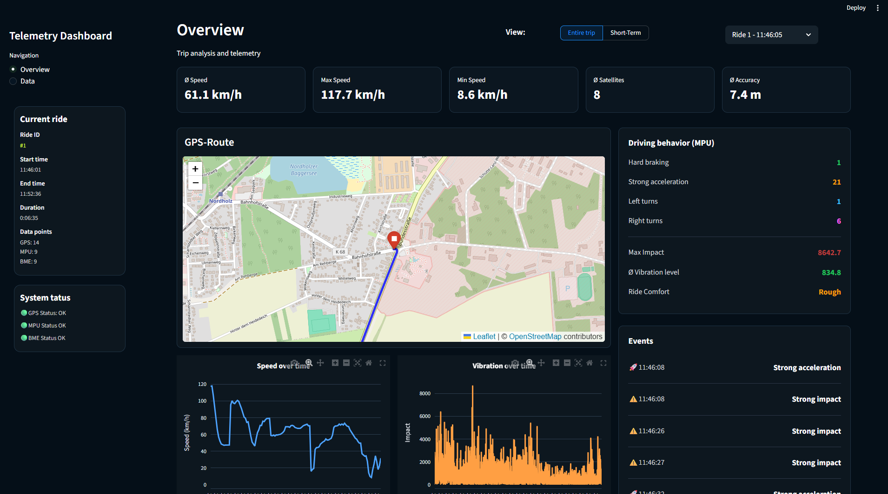

# Sensor Analytics Dashboard
# Overview

The Sensor Analytics Dashboard is a Python-based telemetry analysis application built with Streamlit. It visualizes and analyzes vehicle sensor data collected by an ESP32 using GPS, IMU (MPU6050), and environmental sensors (BME280).

The application allows users to inspect complete trips or short time intervals through an interactive web interface, providing statistics, route visualization, event detection, and detailed sensor analysis.


---

# Features

## GPS Analysis
- Interactive route visualization using Folium
- Total distance calculation
- Average, minimum, and maximum speed
- GPS accuracy statistics
- Average satellite count
- Elevation analysis
- Trip duration
- Start and end timestamps
- Driving Behavior Analysis


## Using MPU6050 sensor data, the dashboard automatically detects:

- Hard braking
- Strong acceleration
- Left turns
- Right turns
- Strong impacts
- Road vibration
- Ride comfort classification

- Recent driving events are displayed together with timestamps.


## Interactive Charts

The dashboard includes several interactive Plotly charts:

- Speed over time
- Vibration / Impact over time

Users can zoom, pan, and inspect every measurement.


## Interactive GPS Map

The dashboard displays:

- Full driven route
- Start position
- End position
- OpenStreetMap integration

  
## Environmental Monitoring

Using the BME280 sensor, the dashboard records:

- Temperature
- Air pressure
- Humidity

Average values are calculated for every trip.


## Trip Management

Users can:

- Select any recorded trip
- View complete trips
- Analyze short-term time windows
- Display trip duration
- Compare different trips


# Dashboard Statistics

The overview page provides:

- Distance traveled
- Driving time
- Standing time
- Time spent moving
- Height above sea level
- Ride comfort
- Sensor status
- Recent driving events


---


# Technologies

## Backend

- Flask
- Python
- SQLite
- Pandas
- Custom Data Analysis Scripts


## Dashboard

- Streamlit
- Plotly
- Folium
- HTML
- CSS


## Embedded System

- ESP32
- GPS (NEO-6M)
- MPU6050
- BME280

---

# Data Flow
```
ESP32
│
├── GPS
├── MPU6050
├── BME280
│
▼
SQLite Database
│
▼
Python Analysis Module
│
▼
Streamlit Dashboard
│
├── Statistics
├── Interactive Charts
├── GPS Map
├── Event Detection
└── Environmental Analysis
```

---

# Installation

### Clone the repository

```bash
git clone https://github.com/Jonaro007/sensor-analytics-dashboard.git
cd sensor-analytics-dashboard
```

### Install dependencies

```bash
pip install -r requirements.txt
```

### Start the application

```bash
python main.py
```

The application automatically starts the Flask backend and launches the Streamlit dashboard.

---

# Hardware Requirements

To recreate the project, the following hardware is required:

- ESP32 Development Board
- GPS Module (NEO-6M)
- MPU6050 Accelerometer and Gyroscope
- BME280 Environmental Sensor


